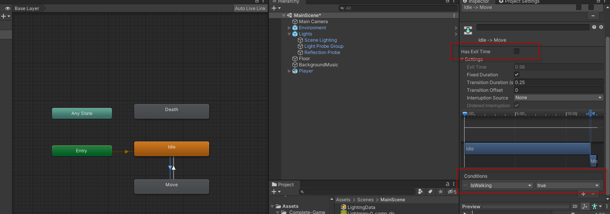
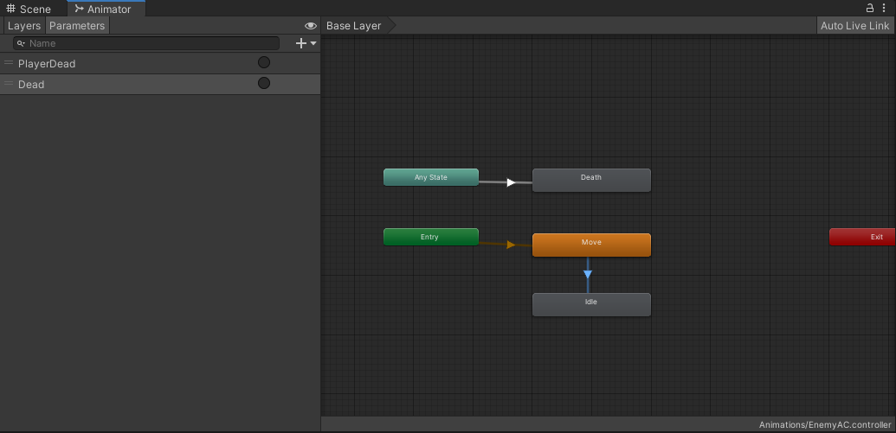
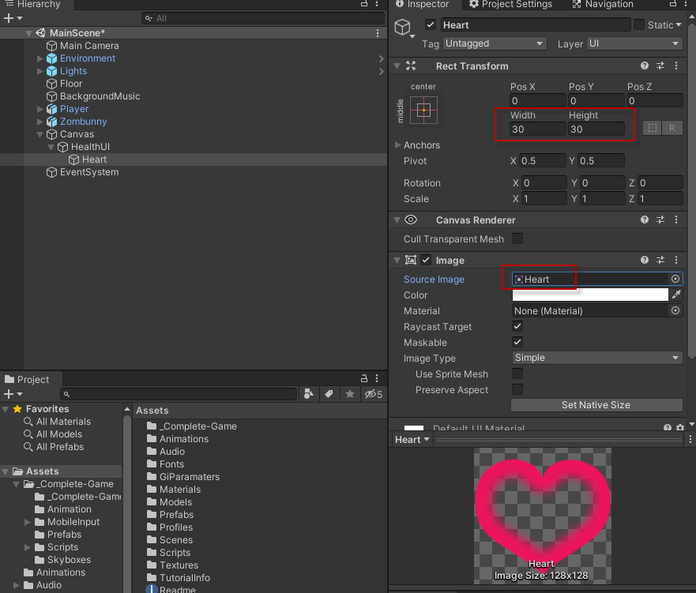
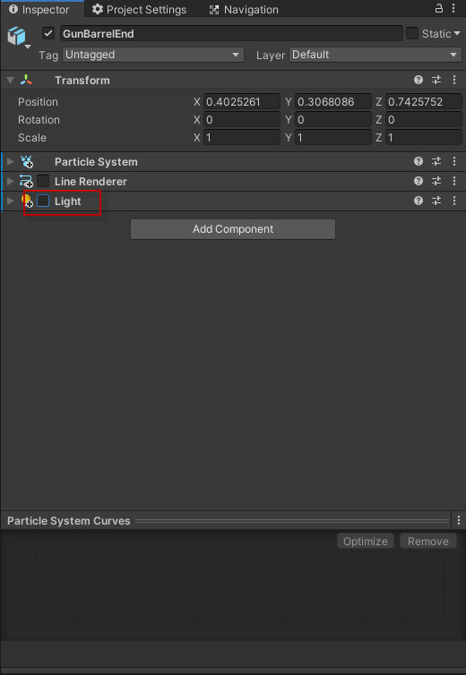
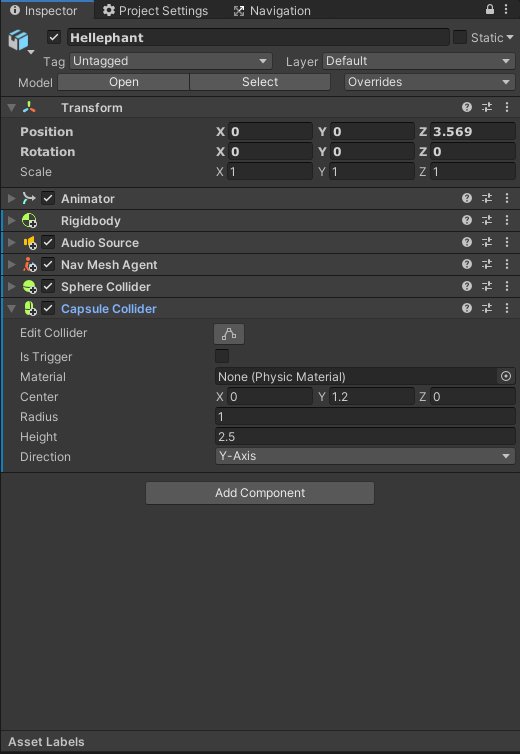

# tutorial-survival-shooter

Unity官方範例 https://learn.unity.com/project/survival-shooter-tutorial

# 場景建置


# 角色控制





# PlayerMovement.cs
```csharp
using UnityEngine;

public class PlayerMovement : MonoBehaviour
{
    public float speed = 6f;
    private Vector3 movement;
    private Animator anim;
    private Rigidbody playerRigidbody;
    private int floorMask;
    private float camRayLength = 100f;

    private void Awake()
    {
        floorMask = LayerMask.GetMask("Floor");
        anim = GetComponent<Animator>();
        playerRigidbody = GetComponent<Rigidbody>();
    }

    private void FixedUpdate()
    {
        float h = Input.GetAxisRaw("Horizontal");
        float v = Input.GetAxisRaw("Vertical");
        Move(h, v);
        Turning();
        Animating(h, v);
    }

    private void Move(float h, float v)
    {
        movement = new Vector3(h, 0, v);
        movement = movement.normalized * speed * Time.deltaTime;
        playerRigidbody.MovePosition(transform.position + movement);
    }

    private void Turning()
    {
        Ray camRay = Camera.main.ScreenPointToRay(Input.mousePosition);
        RaycastHit floorHit;
        if(Physics.Raycast(camRay, out floorHit, camRayLength, floorMask))
        {
            Vector3 playerToMouse = floorHit.point - transform.position;
            playerToMouse.y = 0;
            Quaternion newRotation = Quaternion.LookRotation(playerToMouse);
            playerRigidbody.MoveRotation(newRotation);
        }
    }

    private void Animating(float h, float v)
    {
        bool walking = h != 0 || v != 0;
        anim.SetBool("IsWalking", walking);
    }
}

```
# 攝影機建置


# CameraFollow.cs
```csharp
using System.Collections;
using System.Collections.Generic;
using UnityEngine;

public class CameraFollow : MonoBehaviour
{
    public Transform target;
    public float smoothing = 5f;
    private Vector3 offset;

    // Start is called before the first frame update
    void Start()
    {
        offset = transform.position - target.position;    
    }

    // Update is called once per frame
    void FixedUpdate()
    {
        Vector3 targetCamPos = target.position + offset;
        transform.position = Vector3.Lerp(transform.position, targetCamPos, smoothing * Time.deltaTime);
    }
}

```

# 敵人建置





# 創建生命UI





# 攻擊敵人


# EnemyAttack.cs
移除註解
```csharp
using UnityEngine;
using System.Collections;

public class EnemyAttack : MonoBehaviour
{
    public float timeBetweenAttacks = 0.5f;
    public int attackDamage = 10;


    Animator anim;
    GameObject player;
    PlayerHealth playerHealth;
    EnemyHealth enemyHealth;
    bool playerInRange;
    float timer;


    void Awake ()
    {
        player = GameObject.FindGameObjectWithTag ("Player");
        playerHealth = player.GetComponent <PlayerHealth> ();
        enemyHealth = GetComponent<EnemyHealth>();
        anim = GetComponent <Animator> ();
    }


    void OnTriggerEnter (Collider other)
    {
        if(other.gameObject == player)
        {
            playerInRange = true;
        }
    }


    void OnTriggerExit (Collider other)
    {
        if(other.gameObject == player)
        {
            playerInRange = false;
        }
    }


    void Update ()
    {
        timer += Time.deltaTime;

        if(timer >= timeBetweenAttacks && playerInRange && enemyHealth.currentHealth > 0)
        {
            Attack ();
        }

        if(playerHealth.currentHealth <= 0)
        {
            anim.SetTrigger ("PlayerDead");
        }
    }


    void Attack ()
    {
        timer = 0f;

        if(playerHealth.currentHealth > 0)
        {
            playerHealth.TakeDamage (attackDamage);
        }
    }
}
```





# EnemyMovement.cs
移除註解
```csharp
using UnityEngine;
using System.Collections;

public class EnemyMovement : MonoBehaviour
{
    Transform player;
    PlayerHealth playerHealth;
    EnemyHealth enemyHealth;
    UnityEngine.AI.NavMeshAgent nav;


    void Awake ()
    {
        player = GameObject.FindGameObjectWithTag ("Player").transform;
        playerHealth = player.GetComponent <PlayerHealth> ();
        enemyHealth = GetComponent <EnemyHealth> ();
        nav = GetComponent <UnityEngine.AI.NavMeshAgent> ();
    }


    void Update ()
    {
        if(enemyHealth.currentHealth > 0 && playerHealth.currentHealth > 0)
        {
            nav.SetDestination (player.position);
        }
        else
        {
            nav.enabled = false;
        }
    }
}
```
# PlayerHealth.cs
移除註解
```csharp
using UnityEngine;
using UnityEngine.UI;
using System.Collections;
using UnityEngine.SceneManagement;


public class PlayerHealth : MonoBehaviour
{
    public int startingHealth = 100;
    public int currentHealth;
    public Slider healthSlider;
    public Image damageImage;
    public AudioClip deathClip;
    public float flashSpeed = 5f;
    public Color flashColour = new Color(1f, 0f, 0f, 0.1f);


    Animator anim;
    AudioSource playerAudio;
    PlayerMovement playerMovement;
    PlayerShooting playerShooting;
    bool isDead;
    bool damaged;


    void Awake ()
    {
        anim = GetComponent <Animator> ();
        playerAudio = GetComponent <AudioSource> ();
        playerMovement = GetComponent <PlayerMovement> ();
        playerShooting = GetComponentInChildren <PlayerShooting> ();
        currentHealth = startingHealth;
    }


    void Update ()
    {
        if(damaged)
        {
            damageImage.color = flashColour;
        }
        else
        {
            damageImage.color = Color.Lerp (damageImage.color, Color.clear, flashSpeed * Time.deltaTime);
        }
        damaged = false;
    }


    public void TakeDamage (int amount)
    {
        damaged = true;

        currentHealth -= amount;

        healthSlider.value = currentHealth;

        playerAudio.Play ();

        if(currentHealth <= 0 && !isDead)
        {
            Death ();
        }
    }


    void Death ()
    {
        isDead = true;

        playerShooting.DisableEffects ();

        anim.SetTrigger ("Die");

        playerAudio.clip = deathClip;
        playerAudio.Play ();

        playerMovement.enabled = false;
        playerShooting.enabled = false;
    }


    public void RestartLevel ()
    {
        SceneManager.LoadScene (0);
    }
}
```
# 顯示分數


# EnemyHealth.cs
移除註解
```csharp
using UnityEngine;

public class EnemyHealth : MonoBehaviour
{
    public int startingHealth = 100;
    public int currentHealth;
    public float sinkSpeed = 2.5f;
    public int scoreValue = 10;
    public AudioClip deathClip;


    Animator anim;
    AudioSource enemyAudio;
    ParticleSystem hitParticles;
    CapsuleCollider capsuleCollider;
    bool isDead;
    bool isSinking;


    void Awake ()
    {
        anim = GetComponent <Animator> ();
        enemyAudio = GetComponent <AudioSource> ();
        hitParticles = GetComponentInChildren <ParticleSystem> ();
        capsuleCollider = GetComponent <CapsuleCollider> ();

        currentHealth = startingHealth;
    }


    void Update ()
    {
        if(isSinking)
        {
            transform.Translate (-Vector3.up * sinkSpeed * Time.deltaTime);
        }
    }


    public void TakeDamage (int amount, Vector3 hitPoint)
    {
        if(isDead)
            return;

        enemyAudio.Play ();

        currentHealth -= amount;
            
        hitParticles.transform.position = hitPoint;
        hitParticles.Play();

        if(currentHealth <= 0)
        {
            Death ();
        }
    }


    void Death ()
    {
        isDead = true;

        capsuleCollider.isTrigger = true;

        anim.SetTrigger ("Dead");

        enemyAudio.clip = deathClip;
        enemyAudio.Play ();
    }


    public void StartSinking ()
    {
        GetComponent <UnityEngine.AI.NavMeshAgent> ().enabled = false;
        GetComponent <Rigidbody> ().isKinematic = true;
        isSinking = true;
        ScoreManager.score += scoreValue;
        Destroy (gameObject, 2f);
    }
}
```


# 更多的敵人





# 完成遊戲流程


